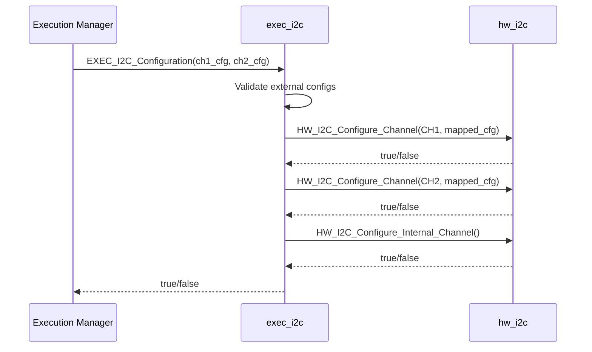
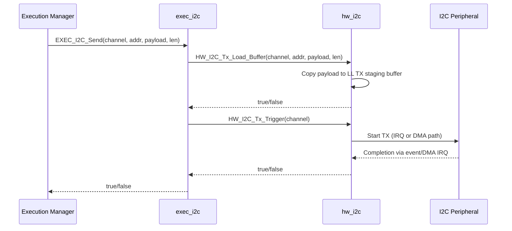
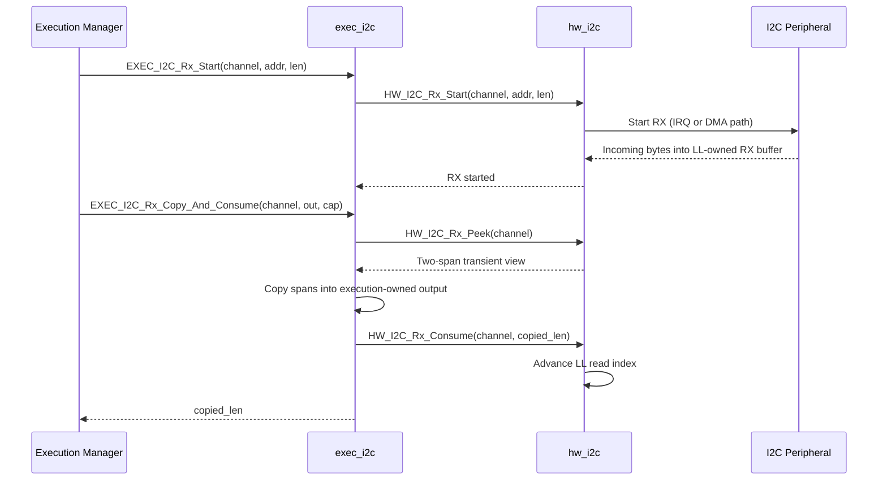

# exec_i2c

## Overview

`exec_i2c` is the mid-level execution-facing I2C adapter.

This module translates higher-level requests into low-level `hw_i2c` operations and enforces a clean ownership boundary:

- mid-level validates user-facing config and maps it to LL config,
- low-level owns hardware interaction and I2C buffers,
- higher layers interact through simple configure/send/receive calls.

---

## Responsibilities

`exec_i2c` is responsible for:

- validating external channel configuration options,
- mapping external channel IDs to LL channel IDs,
- configuring both external channels and internal FMPI channel,
- orchestrating TX as **load staging buffer + trigger transfer**,
- orchestrating RX as **peek + copy + consume**.

It is **not** responsible for direct register access or ISR/DMA logic.

---

## Files

| File         | Role |
|--------------|------|
| `exec_i2c.c` | Mid-level implementation and orchestration |
| `exec_i2c.h` | Mid-level public API and config types |

---

## Public Types

### External channel selection

- `ExecI2cExternalChannel_T`
	- `EXEC_I2C_EXTERNAL_CHANNEL_1`
	- `EXEC_I2C_EXTERNAL_CHANNEL_2`

### Config options

- `ExecI2cMode_T` (master/slave)
- `ExecI2cSpeed_T` (100 kHz / 400 kHz)
- `ExecI2cTransferMode_T` (interrupt / DMA)

### Per-channel config struct

- `ExecI2cChannelConfig_T`
	- mode
	- speed
	- transfer mode
	- own address (7-bit)
	- RX enabled
	- TX enabled

---

## Public API

### `bool EXEC_I2C_Configuration(const ExecI2cChannelConfig_T* channel_1_config, const ExecI2cChannelConfig_T* channel_2_config)`

Purpose:

- configure both external I2C channels and initialize internal FMPI channel policy.

Behavior:

1. validates both external configs,
2. maps each config enum to LL equivalents,
3. configures `HW_I2C_CHANNEL_1` and `HW_I2C_CHANNEL_2`,
4. calls `HW_I2C_Configure_Internal_Channel()`.

Returns `false` if any step fails.

---

### `bool EXEC_I2C_Rx_Start(ExecI2cExternalChannel_T channel, uint8_t target_address_7bit, uint16_t length_bytes)`

Purpose:

- start an RX operation/listening flow on an external channel.

Behavior:

- maps external channel to LL channel,
- calls `HW_I2C_Rx_Start(...)`.

---

### `uint16_t EXEC_I2C_Rx_Copy_And_Consume(ExecI2cExternalChannel_T channel, uint8_t* output, uint16_t output_capacity_bytes)`

Purpose:

- perform full receive handling step in one call.

Behavior:

1. validates inputs,
2. calls LL `HW_I2C_Rx_Peek(...)`,
3. copies unread bytes from first and second spans into caller buffer,
4. calls LL `HW_I2C_Rx_Consume(...)` with copied length,
5. returns number of bytes copied.

This is the core **peek-copy-consume** mid-level pattern.

---

### `bool EXEC_I2C_Send(ExecI2cExternalChannel_T channel, uint8_t target_address_7bit, const uint8_t* payload, uint16_t payload_length_bytes)`

Purpose:

- perform transmit flow in one call.

Behavior:

1. maps channel to LL channel,
2. calls `HW_I2C_Tx_Load_Buffer(...)`,
3. calls `HW_I2C_Tx_Trigger(...)`.

This is the core **stage-and-trigger** mid-level pattern.

---

## Validation Rules in Mid-Level

The internal config validator rejects:

- null config pointers,
- invalid enum values,
- configurations with both RX and TX disabled,
- own addresses outside 7-bit range (`> 0x7F`).

---

## Data Ownership Boundary

- `exec_i2c` does not own LL DMA/ring buffers.
- `exec_i2c` only copies data out of LL spans into caller-owned storage.
- `exec_i2c` explicitly tells LL what has been consumed.

This keeps responsibilities clear between execution layer and hardware layer.

---

## Typical Mid-Level Usage

1. Build two `ExecI2cChannelConfig_T` structs for external channels.
2. Call `EXEC_I2C_Configuration(...)` once.
3. For TX commands, call `EXEC_I2C_Send(...)`.
4. For RX processing:
	- call `EXEC_I2C_Rx_Start(...)` (as needed by role/mode),
	- call `EXEC_I2C_Rx_Copy_And_Consume(...)` into execution-owned result buffer.

---

## Sequence Diagrams

### Configuration Flow

### Transmit Flow (Stage + Trigger)

### Receive Flow (Peek + Copy + Consume)

---

## Dependency

`exec_i2c` links against `hw_i2c` and delegates all hardware-specific behavior to it.