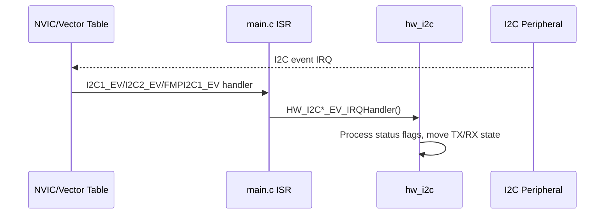
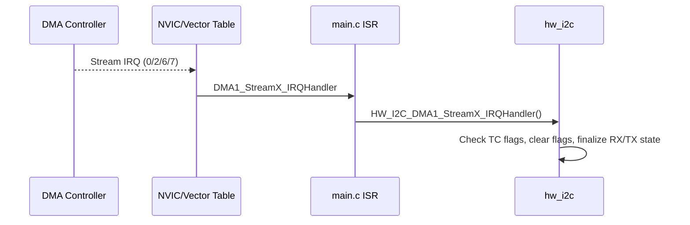
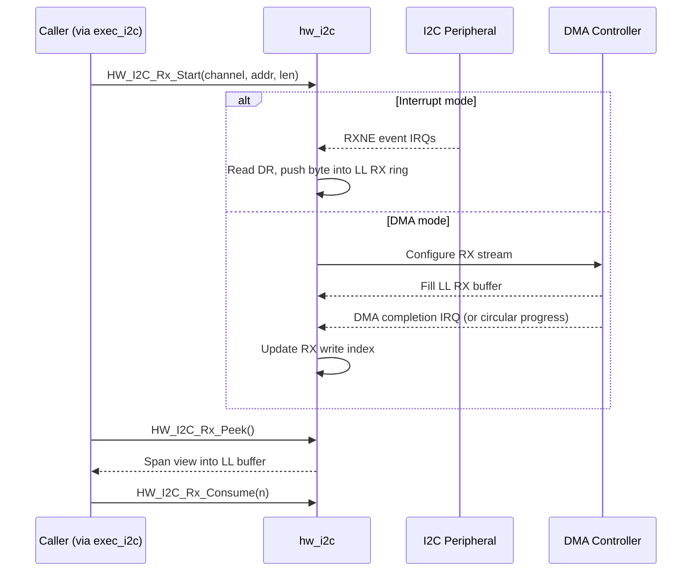
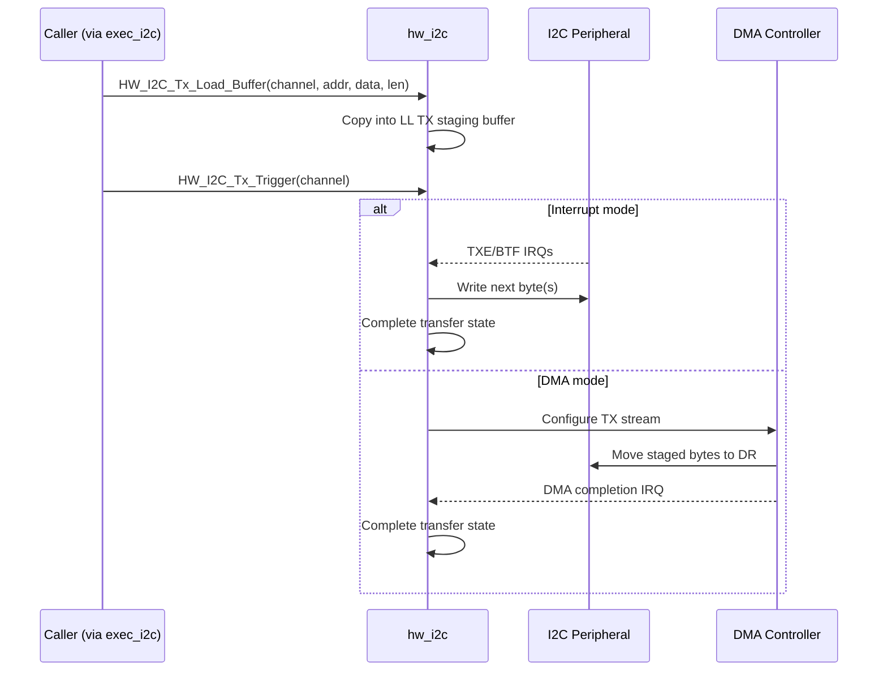

# hw_i2c

## Overview

`hw_i2c` is the low-level, hardware-facing I2C driver for the STM32-based HIL firmware.

This module owns:

- register-level I2C and DMA configuration/use,
- per-channel runtime state,
- LL-owned RX ring buffers and TX staging buffers,
- zero-copy RX peek/consume interfaces,
- IRQ and DMA-stream IRQ handling for I2C traffic completion.

It is designed to be called by `exec_i2c` (mid-level). Higher layers should not touch I2C or DMA registers directly.

---

## Channels and Intended Use

The driver supports three channels:

- `HW_I2C_CHANNEL_1` (external)
- `HW_I2C_CHANNEL_2` (external)
- `HW_I2C_CHANNEL_INTERNAL_FMPI1` (internal board-only channel)

Internal FMPI2C channel policy:

- master mode only,
- 100 kHz only,
- interrupt mode only.

External channels are configurable for:

- master/slave role,
- 100 kHz / 400 kHz,
- interrupt or DMA transfer path.

---

## Files

| File       | Role |
|------------|------|
| `hw_i2c.c` | Implementation (state, register access, IRQ handlers, DMA handlers) |
| `hw_i2c.h` | Public API, enums, config structs, RX span structs |

---

## Public Types

### Configuration enums

- `HwI2cChannel_T`
- `HwI2cRole_T`
- `HwI2cSpeed_T`
- `HwI2cTransferMode_T`

### Configuration struct

- `HwI2cConfig_T`
	- role, speed, transfer mode
	- own 7-bit address
	- RX/TX enabled flags

### RX span types (zero-copy)

- `HwI2cRxSpan_T` (`data + length`)
- `HwI2cRxSpans_T` (up to two contiguous spans + total length)

---

## Public API

### Configuration

- `bool HW_I2C_Configure_Channel(HwI2cChannel_T channel, const HwI2cConfig_T* config)`
	- Validates and stores configuration.
	- Applies external I2C timing and addressing settings for channels 1/2.

- `bool HW_I2C_Configure_Internal_Channel(void)`
	- Applies fixed FMPI2C1 policy (master/100k/interrupt).

### Receive path

- `bool HW_I2C_Rx_Start(HwI2cChannel_T channel, uint8_t target_address_7bit, uint16_t length_bytes)`
	- Starts RX based on channel role and transfer mode.
	- Master mode uses target address and requested length.
	- Slave mode can listen continuously (DMA circular or IRQ byte-by-byte).

- `HwI2cRxSpans_T HW_I2C_Rx_Peek(HwI2cChannel_T channel)`
	- Returns zero-copy transient unread-data view as one or two spans.

- `void HW_I2C_Rx_Consume(HwI2cChannel_T channel, uint32_t bytes_to_consume)`
	- Advances LL read pointer after caller has processed/copied data.

### Transmit path

- `bool HW_I2C_Tx_Load_Buffer(HwI2cChannel_T channel, uint8_t target_address_7bit, const uint8_t* data, uint16_t length_bytes)`
	- Copies payload into LL-owned TX staging buffer.

- `bool HW_I2C_Tx_Trigger(HwI2cChannel_T channel)`
	- Starts actual transfer using configured interrupt/DMA path.

### Interrupt entry points

- Event IRQ wrappers:
	- `HW_I2C1_EV_IRQHandler()`
	- `HW_I2C2_EV_IRQHandler()`
	- `HW_FMPI2C1_EV_IRQHandler()`

- DMA stream IRQ wrappers:
	- `HW_I2C_DMA1_Stream0_IRQHandler()` (I2C1 RX DMA)
	- `HW_I2C_DMA1_Stream2_IRQHandler()` (I2C2 RX DMA)
	- `HW_I2C_DMA1_Stream6_IRQHandler()` (I2C1 TX DMA)
	- `HW_I2C_DMA1_Stream7_IRQHandler()` (I2C2 TX DMA)

---

## RX/TX Ownership Model

### RX ownership

- LL owns all incoming buffers.
- Caller must never write into returned span memory.
- `Peek` returns transient views (may change as new bytes arrive).
- Caller copies needed data to stable storage, then calls `Consume`.

### TX ownership

- LL owns TX staging buffer.
- Caller copies payload in using `HW_I2C_Tx_Load_Buffer`.
- Transfer begins only after `HW_I2C_Tx_Trigger`.

---

## Interrupt vs DMA Behavior

### Interrupt path

- RX: bytes consumed from peripheral data register in event ISR and pushed into RX ring.
- TX: bytes written to peripheral data register in event ISR until complete.

### DMA path

- RX DMA:
	- slave mode may run circular DMA into LL RX ring buffer.
	- master mode uses finite DMA segment; completion updates write index.
- TX DMA:
	- DMA moves staged payload from LL TX buffer to peripheral data register.
	- DMA completion IRQ finalizes transfer state.

---

## External Channel DMA Mapping (Current)

Current hardcoded mapping in `hw_i2c.c`:

- I2C1 RX: DMA1 Stream0, Channel 1
- I2C1 TX: DMA1 Stream6, Channel 1
- I2C2 RX: DMA1 Stream2, Channel 7
- I2C2 TX: DMA1 Stream7, Channel 7

If CubeMX stream/channel assignment changes, update this mapping and related IRQ routing.

---

## Integration Points Outside This Module

### IRQ forwarding in `main.c`

Cube ISR functions are expected to call into this module’s handlers for:

- `I2C1_EV_IRQn`
- `I2C2_EV_IRQn`
- `FMPI2C1_EV_IRQn`
- DMA1 stream 0/2/6/7 IRQs

### DMA NVIC enable in `dma.c`

The following IRQs must be enabled:

- `DMA1_Stream0_IRQn`
- `DMA1_Stream2_IRQn`
- `DMA1_Stream6_IRQn`
- `DMA1_Stream7_IRQn`

---

## Performance Notes

- Hot-path helper functions use inline ring-buffer math.
- RX ring buffer size is power-of-two to use bitmask wrap (avoid modulo).
- Register-level operation avoids HAL overhead in transfer hot path.

---

## Known Assumptions / Limitations

- Timing calculations currently assume APB1 clock of 45 MHz.
- Error-recovery behavior is basic (sufficient for current flow, not full fault-state machine).
- Master RX DMA path currently requires contiguous free segment from current write index.

---

## Typical LL Usage Pattern (Conceptual)

1. Configure channel (`HW_I2C_Configure_Channel`).
2. For TX: load (`HW_I2C_Tx_Load_Buffer`) then trigger (`HW_I2C_Tx_Trigger`).
3. For RX: start (`HW_I2C_Rx_Start`).
4. Poll/process via `HW_I2C_Rx_Peek`.
5. After copying/processing, call `HW_I2C_Rx_Consume`.

---

## Sequence Diagrams

### Event IRQ Routing

### DMA IRQ Routing

### RX Path (Interrupt vs DMA)

### TX Path (Interrupt vs DMA)

